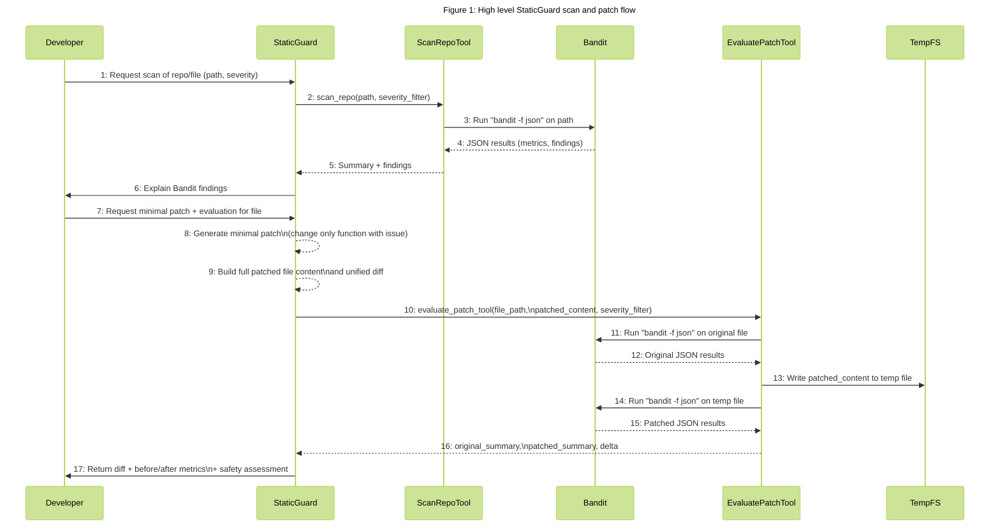

#### Figure 1. High level StaticGuard flow

```mermaid
%%{init: {'theme': 'forest'}}%%
sequenceDiagram
    title Figure 1: High level StaticGuard scan and patch flow
    participant Developer
    participant StaticGuard
    participant ScanRepoTool
    participant Bandit
    participant EvaluatePatchTool
    participant TempFS

    Developer->>StaticGuard: 1: Request scan of repo/file (path, severity)
    StaticGuard->>ScanRepoTool: 2: scan_repo(path, severity_filter)
    ScanRepoTool->>Bandit: 3: Run "bandit -f json" on path
    Bandit-->>ScanRepoTool: 4: JSON results (metrics, findings)
    ScanRepoTool-->>StaticGuard: 5: Summary + findings
    StaticGuard->>Developer: 6: Explain Bandit findings

    Developer->>StaticGuard: 7: Request minimal patch + evaluation for file
    StaticGuard-->>StaticGuard: 8: Generate minimal patch\n(change only function with issue)
    StaticGuard-->>StaticGuard: 9: Build full patched file content\nand unified diff
    StaticGuard->>EvaluatePatchTool: 10: evaluate_patch_tool(file_path,\npatched_content, severity_filter)

    EvaluatePatchTool->>Bandit: 11: Run "bandit -f json" on original file
    Bandit-->>EvaluatePatchTool: 12: Original JSON results
    EvaluatePatchTool->>TempFS: 13: Write patched_content to temp file
    EvaluatePatchTool->>Bandit: 14: Run "bandit -f json" on temp file
    Bandit-->>EvaluatePatchTool: 15: Patched JSON results
    EvaluatePatchTool-->>StaticGuard: 16: original_summary,\npatched_summary, delta

    StaticGuard->>Developer: 17: Return diff + before/after metrics\n+ safety assessment
```
