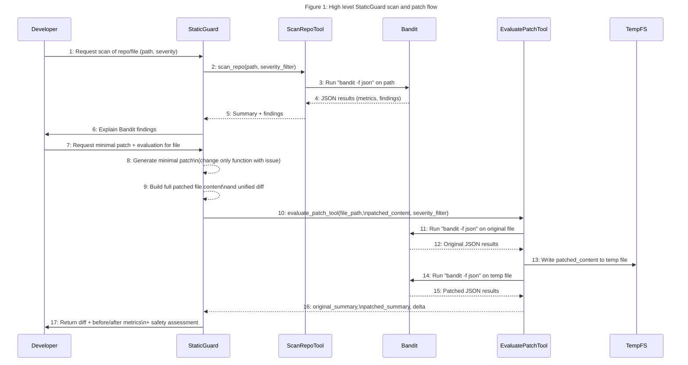
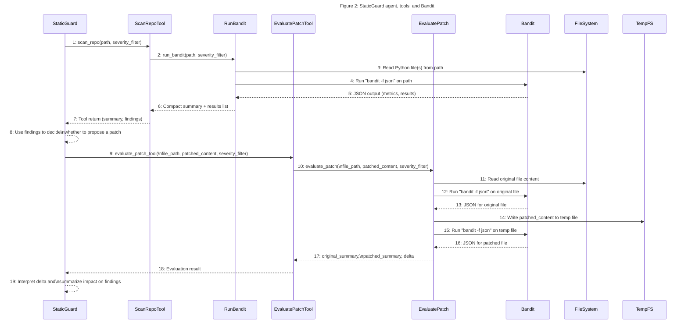
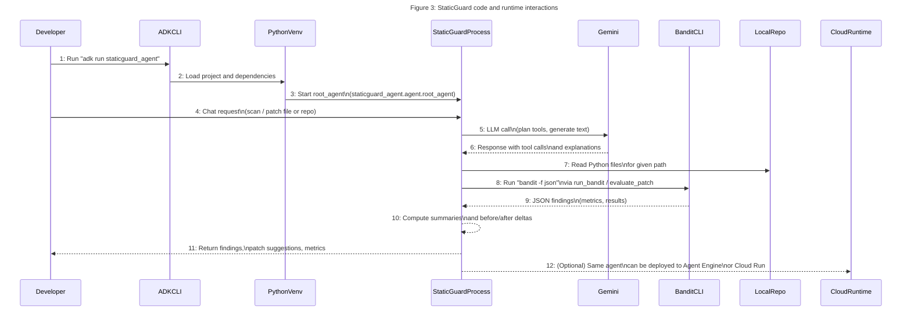

#### Figure 1. High level StaticGuard flow

```mermaid
%%{init: {'theme': 'default'}}%%
sequenceDiagram
    title Figure 1: High level StaticGuard scan and patch flow
    participant Developer
    participant StaticGuard
    participant ScanRepoTool
    participant Bandit
    participant EvaluatePatchTool
    participant TempFS

    Developer->>StaticGuard: 1: Request scan of repo/file (path, severity)
    StaticGuard->>ScanRepoTool: 2: scan_repo(path, severity_filter)
    ScanRepoTool->>Bandit: 3: Run "bandit -f json" on path
    Bandit-->>ScanRepoTool: 4: JSON results (metrics, findings)
    ScanRepoTool-->>StaticGuard: 5: Summary + findings
    StaticGuard->>Developer: 6: Explain Bandit findings

    Developer->>StaticGuard: 7: Request minimal patch + evaluation for file
    StaticGuard-->>StaticGuard: 8: Generate minimal patch\n(change only function with issue)
    StaticGuard-->>StaticGuard: 9: Build full patched file content\nand unified diff
    StaticGuard->>EvaluatePatchTool: 10: evaluate_patch_tool(file_path,\npatched_content, severity_filter)

    EvaluatePatchTool->>Bandit: 11: Run "bandit -f json" on original file
    Bandit-->>EvaluatePatchTool: 12: Original JSON results
    EvaluatePatchTool->>TempFS: 13: Write patched_content to temp file
    EvaluatePatchTool->>Bandit: 14: Run "bandit -f json" on temp file
    Bandit-->>EvaluatePatchTool: 15: Patched JSON results
    EvaluatePatchTool-->>StaticGuard: 16: original_summary,\npatched_summary, delta

    StaticGuard->>Developer: 17: Return diff + before/after metrics\n+ safety assessment
```

#### Figure 2. StaticGuard agent and tools

```mermaid
%%{init: {'theme': 'default'}}%%
sequenceDiagram
    title Figure 2: StaticGuard agent, tools, and Bandit

    participant StaticGuard
    participant ScanRepoTool
    participant RunBandit
    participant EvaluatePatchTool
    participant EvaluatePatch
    participant Bandit
    participant FileSystem
    participant TempFS

    %% Scan path and explain findings

    StaticGuard->>ScanRepoTool: 1: scan_repo(path, severity_filter)
    ScanRepoTool->>RunBandit: 2: run_bandit(path, severity_filter)
    RunBandit->>FileSystem: 3: Read Python file(s) from path
    RunBandit->>Bandit: 4: Run "bandit -f json" on path
    Bandit-->>RunBandit: 5: JSON output (metrics, results)
    RunBandit-->>ScanRepoTool: 6: Compact summary + results list
    ScanRepoTool-->>StaticGuard: 7: Tool return (summary, findings)

    StaticGuard-->>StaticGuard: 8: Use findings to decide\nwhether to propose a patch

    %% Evaluate a patch for a specific file

    StaticGuard->>EvaluatePatchTool: 9: evaluate_patch_tool(\nfile_path, patched_content, severity_filter)
    EvaluatePatchTool->>EvaluatePatch: 10: evaluate_patch(\nfile_path, patched_content, severity_filter)

    EvaluatePatch->>FileSystem: 11: Read original file content
    EvaluatePatch->>Bandit: 12: Run "bandit -f json" on original file
    Bandit-->>EvaluatePatch: 13: JSON for original file

    EvaluatePatch->>TempFS: 14: Write patched_content to temp file
    EvaluatePatch->>Bandit: 15: Run "bandit -f json" on temp file
    Bandit-->>EvaluatePatch: 16: JSON for patched file

    EvaluatePatch-->>EvaluatePatchTool: 17: original_summary,\npatched_summary, delta
    EvaluatePatchTool-->>StaticGuard: 18: Evaluation result
    StaticGuard-->>StaticGuard: 19: Interpret delta and\nsummarize impact on findings

```

#### Figure 2. StaticGuard agent and tools

```mermaid
%%{init: {'theme': 'default'}}%%
sequenceDiagram
    title Figure 3: StaticGuard code and runtime interactions

    participant Developer
    participant ADKCLI
    participant PythonVenv
    participant StaticGuardProcess
    participant Gemini
    participant BanditCLI
    participant LocalRepo
    participant CloudRuntime

    Developer->>ADKCLI: 1: Run "adk run staticguard_agent"
    ADKCLI->>PythonVenv: 2: Load project and dependencies
    PythonVenv->>StaticGuardProcess: 3: Start root_agent\n(staticguard_agent.agent.root_agent)

    Developer->>StaticGuardProcess: 4: Chat request\n(scan / patch file or repo)
    StaticGuardProcess->>Gemini: 5: LLM call\n(plan tools, generate text)
    Gemini-->>StaticGuardProcess: 6: Response with tool calls\nand explanations

    StaticGuardProcess->>LocalRepo: 7: Read Python files\nfor given path
    StaticGuardProcess->>BanditCLI: 8: Run "bandit -f json"\nvia run_bandit / evaluate_patch
    BanditCLI-->>StaticGuardProcess: 9: JSON findings\n(metrics, results)

    StaticGuardProcess-->>StaticGuardProcess: 10: Compute summaries\nand before/after deltas
    StaticGuardProcess-->>Developer: 11: Return findings,\npatch suggestions, metrics

    StaticGuardProcess-->>CloudRuntime: 12: (Optional) Same agent\ncan be deployed to Agent Engine\nor Cloud Run
```
